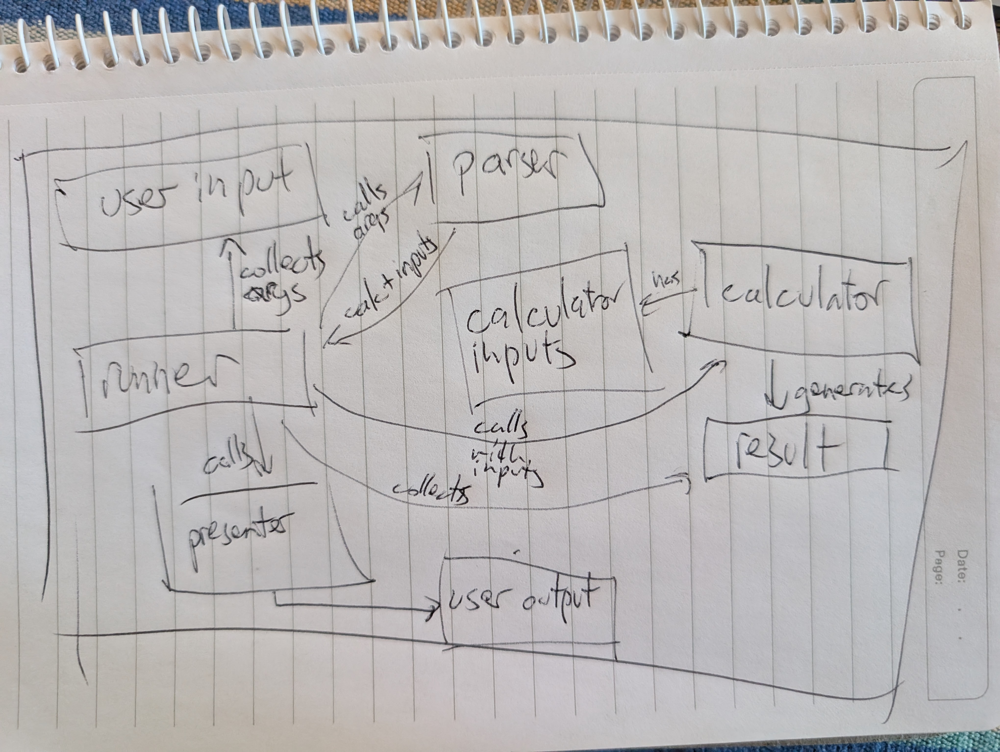

# North Star

Purpose: An ideal (likely utopian) end state that will evolve over time, and may never be fully realised but will assist with keeping on track, and provide general insight into my thinking.

- **User Input** represents the arguments to run a calculation
- **Parser** can parse User Input into domain objects (defined inputs and a Calculator), and provide Feedback on invalid User Input
- **Calculator** uses defined inputs to perform the calculation and generate a **Result**
- **Presenter** knows how to present a Calculator Result
- **Runner** parses User Input using its Parser to call a Calculator, then presents the Result using a Presenter

